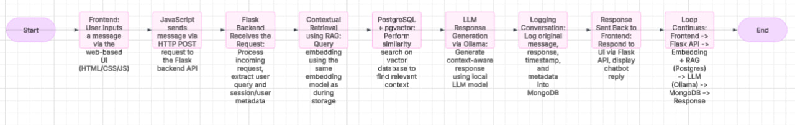

# 🧠 AiAgentChatbot

A powerful conversational AI chatbot built using **Flask** and **Ollama**, enhanced with **Retrieval-Augmented Generation (RAG)** using **PostgreSQL + pgvector** for intelligent, context-aware responses. Conversations are stored in **MongoDB**, and the web interface is crafted using **HTML, CSS**, and **JavaScript**.

---

## ⚙️ Prerequisites

Before setting up the project, make sure you have the following tools installed:

- 🐳 **Docker** – for setting up PostgreSQL with `pgvector` extension
- 🐘 **PostgreSQL** – used as the vector database (can be run via Docker)
- 🍃 **MongoDB** – stores chat message logs
- 🐍 **Python IDE** – e.g., VS Code, PyCharm, etc.
- 📬 **Postman** – to test API endpoints (optional, helpful for debugging)
- 💻 **Node.js** – runtime for front-end JS tools (if needed in future)
- 🌐 **HTML / CSS / JavaScript** – used for building the chat UI
- 🤖 **Ollama** – local LLM runner (https://ollama.com)

> 💡 **Recommended Model**:  
> - Use `Mistral` if your machine has **6–8 GB RAM**  
> - Use heavier models (e.g., `LLaMA2`, `Mixtral`) if you have **more system resources**

---

## 🚀 Features

- 🗣️ Chat interface powered by local LLMs using Ollama
- 🧠 RAG-enabled context retrieval from PostgreSQL + pgvector
- 📝 Logs and stores conversations in MongoDB
- 🧩 Modular backend: LLM client, prompt builder, chat service
- 🌐 Frontend built with HTML, CSS, and JavaScript
- ✅ Unit-tested components (Postgres, LLM, prompts)

---

## 🐳 Setting Up with Docker

This project provides a Docker setup to quickly spin up a PostgreSQL instance **with pgvector extension**.

### 1. Run PostgreSQL with pgvector using Docker

```bash
docker -t build -pgvector .
docker run -d --name pgvector -p 5432:5432 -e POSTGRES_PASSWORD=your_password -e POSTGRES_USER=your_user -e POSTGRES_DB=your_db pgvector/postgres:latest
```
This downloads the necessary Postgres image with pgvector extension and runs the container.

If you already have PostgreSQL with pgvector installed locally, you can skip this step.


### 2. Create a Database and Table
Once PostgreSQL is running, use a database client or CLI to:

Create the chatbot's RAG database

Ensure pgvector is installed and available:

```sql
CREATE EXTENSION IF NOT EXISTS vector;
```
Create the table for storing vectors:


# **Clone the repo**
git clone https://github.com/Nagamiji/AiAgentChatbot.git
cd AiAgentChatbot

# Create and activate a virtual environment

```python
python -m venv venv
venv\Scripts\activate         # On Windows

source venv/bin/activate      # On macOS/Linux
```

# Install dependencies
```bash
pip install -r requirements.txt
```

# Set up environment variables
```bash 
cp .env.example .env          # Or manually create a .env file
```     

# Run the app
app.py

# 🧱 **Built With**
🔧 Backend
Flask – Python web framework

Ollama – local LLM interface

PostgreSQL + pgvector – semantic search and retrieval for RAG

MongoDB – chat logs and session tracking

Pytest – for unit testing

# **🎨 Frontend**
HTML – structure

CSS – styling

JavaScript – dynamic interaction and API calls

# **📌 To-Do / Future Improvements**
 Add user authentication

 Enable real-time WebSocket chat

 Add document upload for dynamic RAG ingestion

 Create admin panel for MongoDB analytics

 Export chat history per user/session

# **📄 License**
MIT License – free to use, modify, and distribute.

# **🙌 Acknowledgments**
Gratitude to the open-source communities powering Flask, Ollama, pgvector, and all the tools that made this possible.

vbnet
Copy
Edit

Let me know if you want a downloadable `.md` file or want me to add Docker commands for MongoDB too!


## 🧪 Running Locally (Backend)

> ✅ **Make sure [Ollama](https://ollama.com) is installed** and a model like `mistral` is running locally.

```bash
# Clone the repo
git clone https://github.com/Nagamiji/AiAgentChatbot.git
cd AiAgentChatbot

# Create and activate a virtual environment
python -m venv venv
venv\Scripts\activate         # On Windows
# or
source venv/bin/activate      # On macOS/Linux

# Install dependencies
pip install -r requirements.txt

# Set up environment variables
cp .env.example .env          # Or manually create a .env file

# Run the app
python app.py
```
🧱 Built With
🔧 Backend
Flask – Python web framework

Ollama – local LLM interface

PostgreSQL + pgvector – semantic search and retrieval for RAG

MongoDB – chat logs and session tracking

Pytest – unit testing

🎨 Frontend
HTML – structure

CSS – styling

JavaScript – dynamic interaction and API calls

📌 To-Do / Future Improvements
 Add user authentication

 Enable real-time WebSocket chat

 Add document upload for dynamic RAG ingestion

 Create admin panel for MongoDB analytics

 Export chat history per user/session

📄 License
MIT License – free to use, modify, and distribute.

🙌 Acknowledgments
Gratitude to the open-source communities powering Flask, Ollama, pgvector, and all the tools that made this possible.

yaml
Copy
Edit

---

✅ Let me know if you want this exported as an actual `.md` file or if you’d like the **MongoDB Docker setup** added too.


